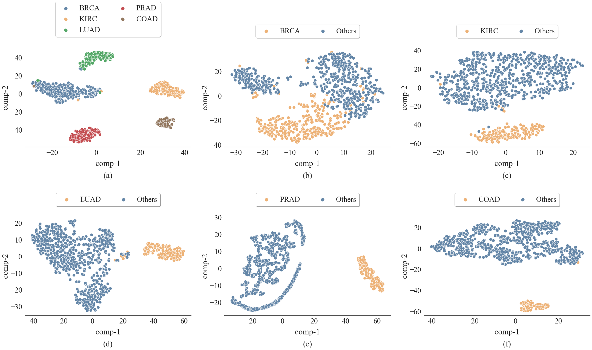
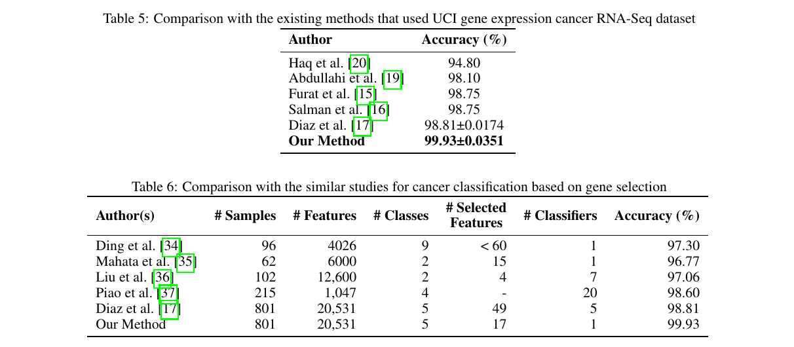

# Biomarker Identification by Reversing the Learning Mechanism of Autoencoder and Recursive Feature Elimination

by
Fuad Al Abir, S.M. Shovan, Md. Al Mehedi Hasan, Abu Sayeed, Jungpil Shin

This paper is submitted for publication in Molecular Omics, A Royal Society of Chemistry journal.

**Summary**: We have identified 17 biomarkers for five types of tumor from gene expression data using autoencoder and recursive feature elimination. Classifying the cancer types using only the biomarkers yielded state-of-the-art results. We also obtained class-wise biomarkers for each of the five classes.

The t-SNE projection for (a) all five cancer types, (b) BRCA vs. others, (c) KIRC vs. others, (d) LUAD vs.others, (e) PRAD vs. others, and (f) COAD vs. others. Gene expression level for all the selected biomarkers for eachcancer (listed at Table 3 and Table 4) is reduced into 2 components denoted by comp-1 and comp-2. Two-dimensionalrepresentation of the five classes is linearly distinguishable in multiclass classification (a), which is also true for (c), (d),(e) and (f) ignoring the minor overlaps.

## Abstract

RNA-Seq has made significant contributions to various fields, particularly in cancer research. Recent studies on differential gene expression analysis and the discovery of novel cancer biomarkers have used RNA-Seq data extensively. New biomarker identification is essential for moving cancer research forward, and early cancer diagnosis improves patients' chances of recovery and increases life expectancy. There is an urgency and scope of improvement in both sections. In this paper, we developed an autoencoder-based biomarker identification method successfully applied to the UCI gene expression cancer RNA-Seq dataset consisting of five cancerous tumor types. By reversing the learning mechanism of the trained autoencoders, we devised an explainable post hoc methodology for identifying the influential genes with a high likelihood of becoming biomarkers. We applied recursive feature elimination to shorten the list further and presented a list of 17 potential biomarkers that are 99.93\% accurate in identifying cancer types using support vector machine. Furthermore, we have compiled and validated separate lists of potential biomarkers for each cancer type. Our results outperform the state-of-the-art methods and confirm the potentiality of the newly identified biomarkers and the efficacy of the biomarker identification procedure. The source code of this project is available at [https://github.com/fuad021/biomarker-identification](https://github.com/fuad021/biomarker-identification).

## Implementation

All source code used to generate the results and figures in the paper are in the notebook. In `supplementary-files` folder, we provided all supplementary files. `other-data` folder contains the dataset, trained autoencoder and other files generated in this project and `figure` folder contains the results and diagrams used in the manuscript.

## Getting the code

You can download a copy of all the files in this repository by cloning the git repository:

    git clone https://github.com/fuad021/biomarker-identification.git

## Dataset
All the primary and independent datasets used in this study can be found here: https://drive.google.com/drive/folders/1qugY2wVqW9aFfHCawFPKibIdHSz06Jdd?usp=sharing
    
<!-- ## Dependencies -->
<!-- We have used google colab in this project for free GPU support. If anyone wish to create a similay environment, requirement is listed in `requirement.txt` file which was generated using `pip freeze > requirements.txt`. -->

## Reproducing the results
Following the instruction provided in the notebook will be sufficient to reproducing the results.

## Flow-diagram

A. Model architecture and B. the training procedure using all classes of gene expression data. After training, a separately trained autoencoder for each type of cancer is yielded. C. Flow diagram of the biomarker identification method. The number of genes in primary gene selection varies concerning a particular class and curve growth threshold. However, the number of selected genes usually ranges in tens for proper threshold choice. Therefore we have denoted the numbers using XX. In RFE, we used SVM as the base classifier.

## Results

